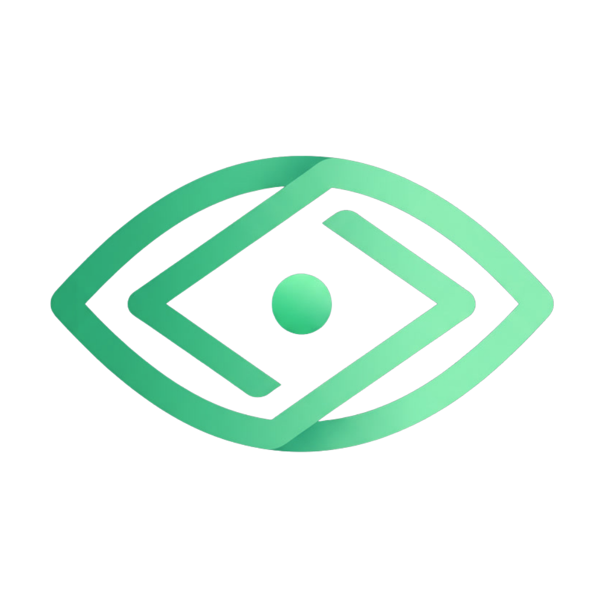
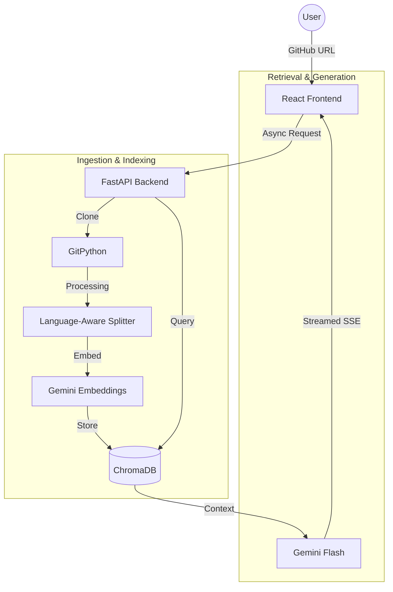

# CodeLens AI  
### Semantic Codebase Intelligence

<p align="center">
  
</p>

**CodeLens AI** is a high-performance **Retrieval-Augmented Generation (RAG)** system designed to provide deep, context-aware insights into software repositories. By combining a modern web interface with a robust asynchronous backend, it transforms raw source code into an interactive, searchable knowledge base.

---

## Core Philosophy

### 🔒 Zero-Persistence Utility
Designed for privacy-first analysis where data is processed and stored in ephemeral or persistent vector volumes as needed, minimizing infrastructure overhead.

### 🧠 Semantic Integrity
Uses language-aware splitting to ensure logical code blocks (functions, classes, and modules) maintain their structural context during the embedding process.

### ⚡ Real-Time Feedback
Implements **Server-Sent Events (SSE)** to provide users with live indexing logs and streaming AI responses.

---

## Tech Stack & Rationale

| Layer | Technology | Rationale |
|-----|-----------|-----------|
| Frontend | React + Vite | High-performance, reactive UI with near-instant HMR and optimized production builds |
| Backend | FastAPI | Native async support, ideal for non-blocking Git operations and SSE streaming |
| Styling | Tailwind CSS | Utility-first CSS for rapid development and dark-mode-first UI |
| Intelligence | Gemini Flash | Large context window and high-speed reasoning for large codebases |
| Vector Engine | ChromaDB | Lightweight, AI-native vector database for fast similarity search |
| Containerization | Docker | Multi-stage build packaging frontend and backend into a single image |
| Orchestration | LangChain | Standardizes RAG lifecycle (loading, chunking, prompting) |

---

## Workflow Architecture

### 1. Ingestion Phase
- Performs a **shallow clone** of the target repository using **GitPython**
- Filters non-source files and respects `.gitignore`

### 2. Processing & Vectorization
- Language-aware recursive chunking
- 768-dimensional embeddings via Gemini

### 3. Reasoning & Retrieval
- Cosine similarity search on ChromaDB
- File-path and line-number grounded answers

---

## Architecture Diagram



---

## Setup & Installation

### Prerequisites
- Docker
- Docker Compose
- Google Gemini API Key

### Local Development

```bash
git clone https://github.com/your-username/code-lens-ai.git
cd code-lens-ai
```

Create a `.env` file:

```env
GEMINI_API_KEY=your_api_key_here
GEMINI_MODEL=models/gemini-3-flash-preview
```

Run with Docker:

```bash
docker-compose up --build
```

Open:

http://localhost:8080

---

## Deployment

Configured for Render and similar PaaS platforms using a multi-stage Docker build and single-origin FastAPI serving.

---

## License

Apache License 2.0
