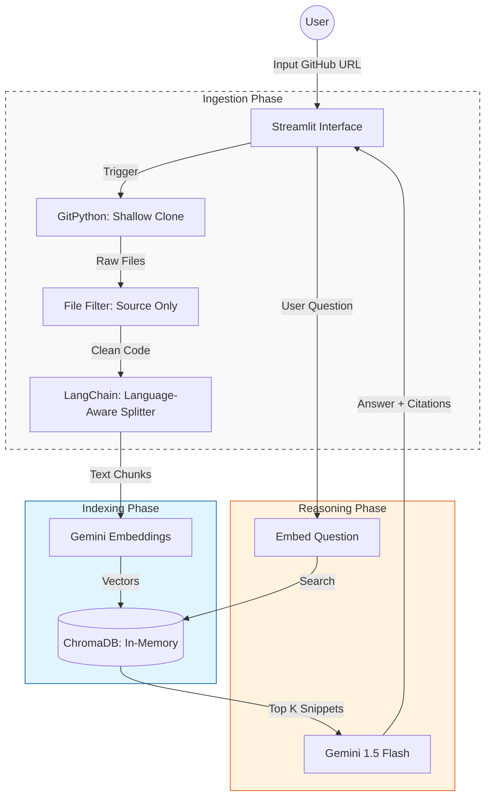

# CodeLensAI: Semantic Codebase Intelligence
CodeLensAI is an advanced Retrieval-Augmented Generation (RAG) system designed to provide deep, context-aware insights into software repositories. It transforms raw source code into a searchable knowledge base without the overhead of persistent infrastructure.

## The Vision
This system addresses the challenge of navigating complex, large-scale repositories by decoupling knowledge acquisition (indexing) from reasoning (querying)

### Core Philosophy
1) Zero-Persistence: In-memory vector storage ensures data privacy and zero database maintenance.
2) Contextual Integrity: Language-aware splitting ensures that logical blocks (functions/classes) are never bifurcated during chunking.
3) Asynchronous Processing: A non-blocking ingestion pipeline ensures a smooth UX during heavy computational tasks.

## Features
* Smart Ingestion: Automated cloning and filtering (respects .gitignore and skips non-source binaries).
* Language-Aware RAG: Optimized chunking for Python, JavaScript, and other major languages.
* Citations & Traceability: Every answer includes exact file paths and line number references.
* Live Analysis Logs: Real-time feedback during the repository indexing phase.

## Tech Stack
| Layer          | Technology          | Rationale                                                                                                   |
|----------------|---------------------|--------------------------------------------------------------------------------------------------------------|
| Interface      | Streamlit           | Enables a reactive, Python-native web interface with built-in session state management.                      |
| Intelligence   | Gemini 1.5 Flash    | High-speed reasoning with a massive 1M token context window for complex code analysis.                       |
| Vector Engine  | ChromaDB            | In-memory vector store that allows for high-performance similarity search without database overhead.         |
| Embeddings     | text-embedding-004  | Google's latest embedding model optimized for semantic retrieval and code understanding.                     |
| Orchestration  | LangChain           | Manages the RAG lifecycle, including document loading, chunking, and prompt templating.                      |
| Source Control | GitPython           | Programmatic repository management for shallow cloning and automated file extraction.                        |

## Workflow
1) Ingestion: Shallow clone of the target GitHub repository.
2) Processing: Recursive character splitting with language-specific separators.
3) Vectorization: Generating semantic embeddings via Google's text-embedding-004.
4) Retrieval: Similarity search on user queries to pull top-K relevant snippets.
5) Synthesis: Augmented generation with citations provided back to the user.

## Privacy
* No Data Retention: All indexed vectors and temporary files are purged upon session termination.
* Secret Filtering: Basic scanners prevent the indexing of .env files or hardcoded credentials detected during the scan.